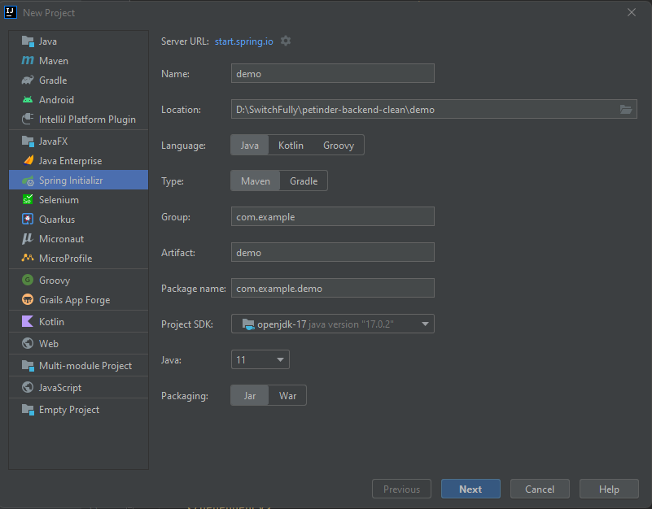
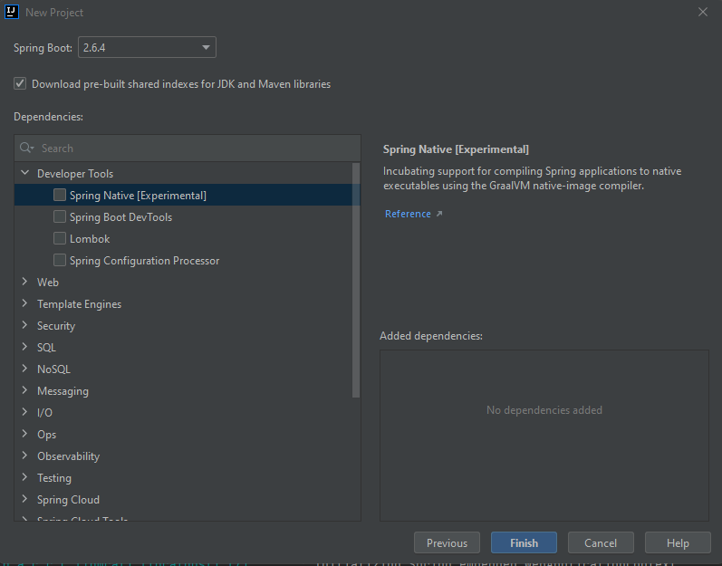

## Spring Boot

In a few weeks, we will be reaching our web-development module. In this module, you will create a working frontend for our award-winning-soon-to-be-sold-to-Google-for-billions-app Petinder. Because pets need love too!
Of course, our frontend will need a backend application to connect to. This will be a Spring Boot app and you will start building its foundations today!

### Setting up a Spring Boot project

There are three ways to get started with a brand new Spring Boot application. We'll implement all three of them. Afterwards, you will be able to choose the one that you find best.

#### All by myself (Apologies if you hear Celine Dion singing this in your head after reading it :trollface:)

The first way is setting everything up from scratch with no help whatsoever. We will start by creating a new Maven project. Spring Boot is fully compatible with Maven 3.0 or above. After clicking next a few times, you will be presented with an empty project. We will have to add the right configuration
to our POM in order to start using Spring Boot as our framework. Any Spring Boot dependency that you add, will use the ``org.springframework.boot`` groupId. Over time, you will learn there are tons of dependencies out there, each tailoring to different needs. Just to clarify it a bit more with a few examples:

- ```spring-boot-starter-data-jpa``` will add functionality to use JPA. It's database related and you'll learn all about JPA in the next module.
- ```spring-boot-starter-security``` adds Spring Security to a project. With the right implementation, it can secure your project. More on that later as well!

In our ```pom.xml```, this looks as follows:

```
<dependencies>
  <dependency>
    <groupId>org.springframework.boot</groupId>
    <artifactId>spring-boot-starter-data-jpa</artifactId>
  </dependency>
  <dependency>
    <groupId>org.springframework.boot</groupId>
    <artifactId>spring-boot-starter-security</artifactId>
  </dependency>
</dependencies>
```

These are just examples, no need to actually add them to your pom for this codelab.

Back to configuring Spring Boot! Typically, your Maven POM file will inherit from the spring-boot-starter-parent project and declare dependencies to one or more “Starter POMs”. Starter POMs are a set of convenient dependency descriptors that you can include in your application. 
You get a one-stop-shop for all the Spring and related technology that you need, without having to hunt through sample code and copy and paste loads of dependency descriptors. 
For example, if you want to get started using Spring and JPA for database access, just include the spring-boot-starter-data-jpa dependency in your project, and you are good to go.

In our case, we are only interested (for now) in the dependencies that we need to have the core Spring Boot functionalities. For this, we have to add two things:
- A link to the spring-boot-starter-parent project, where our project will inherit from
- The spring-boot-starter dependency

##### The parent POM

Check our current ``pom.xml`` and take a look at what we have. You should see the very basic parts that our project needs to qualify as a Maven project. If you're unsure what that looks like, go back to the slides on Maven and Pom files, it's mentioned there. Time to add some extra parts here.

* Add a ``parent`` block that will refer to spring-boot-starter-parent. To do this, add a parent block as follows:
```
<parent>
</parent>
```
Inside that parent block, we're going to need a groupId, artifactId and a version. Look at how the other attributes in this file are configured, you can follow the same principles within the parent block. 
- The groupId is ``org.springframework.boot`` 
- The artifactId is ``spring-boot-starter-parent`` 
- The version is ``2.6.4`` (or you can look up the latest version in the maven repository )

Lastly we need to tell maven if the parent pom is a pom in your own project or downloaded from the Maven repository.
Since we didn't write spring-boot ourselves, we're going to download it.
- Add ``<relativePath/>`` to your parent block to signal that the parent needs to be downloaded.

That's our first step! We now inherit information from the Spring Boot starter pom. Next we will have to add our dependencies. 

##### Spring boot starter dependency
Since we're only building a vanilla Spring Boot project, we will just need the basic spring boot starter dependency.

* Add a ``dependencies`` block. This block will contain all your dependencies. Inside, add a ``dependency`` block, IntelliJ will try to help you by auto-completing this. In case it didn't, the block will again need a ``groupId``, ``artifactId`` and a ``version``. 
  * The groupId is ``org.springframework.boot``
  * The artifactId is ``spring-boot-starter-web`` 
  * The version is the latest one, ``2.6.4``. (Since you are using a parent this can and should be ommited)

> spring-boot-starter-web is used for building web applications, including RESTful applications (what we will be doing in the future). It uses Tomcat as the default embedded container. You can see in the output that a Tomcat server is running. 


You'll notice IntelliJ wants to help you while you're typing, it can do this since it is connected to Maven's central repository. That way it has access to all kinds of info about every available dependency, making dependency management in IntelliJ easy to do.

This is all the configuration needed to fire up a Spring Boot application. Want to test if everything works the way it should?

* Make a class with a Main method that has ``SpringApplication.run(DemoApplication.class, args);`` inside of that method. To make this a Spring Boot app, all you have to do is add an annotation above the class definition: ``@SpringBootApplication``. If everything was configured the way it should, the compiler will recognize this annotation, and you should be able to start up your app as a Spring Boot app. Try it, and you should see a Spring Boot app running.

This was the first way of setting up a Spring Boot project. Onward to the second!

#### With a little help from my friend aka IntelliJ

Configuring all of this manually is pretty doable, but there has to be a more "automated" way, right? Of course there is! IntelliJ can do a lot of things for us when creating a new project. In fact, it can do almost everything we just did in just a few clicks.

* Start a new project in IntelliJ and choose ``Spring Initializr``. You will have to complete two steps! The first one is configuring either a Maven or a Gradle project. The second one lets you add specific Spring Boot dependencies.



You can see the same information that you manually typed in your pom, can be added through the setup windows here. Fill in the correct info here, pick Spring Web as a dependency and click finish. Your app should be created and no more manual setup should be necessary.

#### Same same, but different

The IntelliJ flow we just went through, is actually an implementation within the IDE from the Spring Initializr web app. If you want to try out a different ui with a few more options, feel free to go to [spring initializr](https://start.spring.io). In here, you can do the same as in IntelliJ, it just looks a bit more clear (depending what you like) and gives you the option to explore the pom you are creating. 
Of course you're not immediately creating a project in IntelliJ. You'll have to download this as a zip file and extract it to the correct spot on your drive. Afterwards, you can open the project in IntelliJ.

### All done, what did you learn?
* You learned three ways to create a vanilla Spring Boot app
* You got some more insight in the specifics of Spring Boot and its dependencies in our pom file
* You learned that a Spring Boot app needs the @SpringBootApplication annotation in the class that contains the main method
