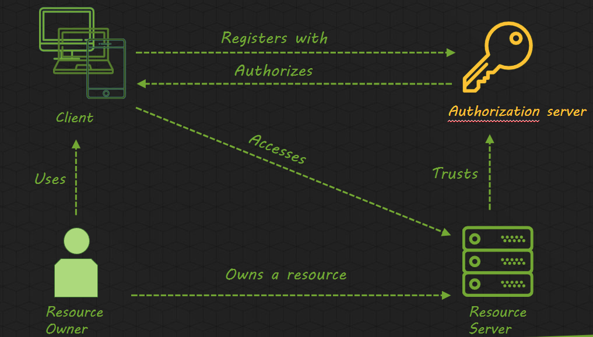

## Setting up security using Spring Security, OAuth and Keycloak

Securing an application is not the easiest thing. There are multiple ways to achieve this and the internet is full of people trying to convince you that their way is the right one! In Switchfully, we won't claim to be showing you the holy grail of
doing this. We will try to provide you with a relatively easy way of securing your work, using an external service called Keycloak to manage our users and connecting our app to that service. We will implement this through OAuth2, a modern standard that is used widely throughout
the industry.

### OAuth2

It's important to have some knowledge on the protocol we are using. We don't expect you to be a security wizard who has a deep theoretical background on all of this, but it's good to have a high-level overview on the technologies we are implementing.
Let's have a quick overview of what ``OAuth2`` is.

OAuth 2.0, which stands for “Open Authorization”, is a standard designed to allow a website or application to access resources hosted by other web apps on behalf of a user. It replaced OAuth 1.0 in 2012 and is now the de facto industry standard for online authorization.
OAuth 2.0 provides consented access and restricts actions of what the client app can perform on resources on behalf of the user, without ever sharing the user's credentials.
Although the web is the main platform for OAuth 2, the specification also describes how to handle this kind of delegated access to other client types (browser-based applications, server-side web applications, native/mobile apps, connected devices, etc.)

OAuth2 uses Access Tokens to authorize users. It doesn't define a specific format for this, but most often you'll find ``Json Web Token``(``JWT``, pronounced ``jot token``) as a format for it. Token issuers include the necessary data in the token itself.

#### OAuth2 components

The whole OAuth2 flow is easier to understand when you know which parties are present and what their role is.

- **Resource Owner**: The user or system that owns the protected resources and can grant access to them.

- **Client**: The client is the system that requires access to the protected resources. To access resources, the Client must hold the appropriate Access Token.

- **Authorization Server**: This server receives requests from the Client for Access Tokens and issues them upon successful authentication and consent by the Resource Owner. The authorization server exposes two endpoints: the Authorization endpoint, which handles the interactive authentication and consent of the user, and the Token endpoint, which is involved in a machine to machine interaction.

- **Resource Server**: A server that protects the user’s resources and receives access requests from the Client. It accepts and validates an Access Token from the Client and returns the appropriate resources to it.

#### OAuth2 flow

Let's take a look at how OAuth2 actually works. We'll see the different steps needed before a request can be authenticated.

1. Using OAuth2, access requests are initiated by the client. This can be a mobile-app, website, desktop app,... At first, the client will request authorization from the Authorization Server (Keycloak in our case). This can be done by supplying a ``client-id`` and ``client-secret`` in order to identify with the Authorization Server. It also provides scopes and an endpoint URI to send the Access Token to.
2. The Authorization Server authenticates the client and verifies that its requested scopes are permitted.
3. The Resource Owner interacts with the Authorization Server to grant access.
4. The Authorization Server redirects back to the client with an Access Token.
5. With this Access Token, the client requests access to the resource it needs from the Resource Server.

The slides show some more info on OAuth2 and its flow and has some good links at the end where you can get more info. Have a look if you are looking for some more in-depth knowledge on this protocol.

### Keycloak

As said before, we will be using an external service that manages our users and authorizes them to certain functionalities by issuing tokens. There are quite a few of these services available. Okta and Keycloak are both well-known and used by a lot of companies. We will use Keycloak!
Let's take a look at Keycloak first, before securing our Petinder backend app.

Switchfully has its own Keycloak server running at [Switchfully Keycloak](https://keycloak.switchfully.com). We will be using this server to secure our app during the next codelabs. Alternatively, you can easily run a local Keycloak server using Docker. If you want to know more on that, just ask one of the coaches to explain it a bit more.
- Surf to [Switchfully Keycloak](https://keycloak.switchfully.com) and log in using temp/temp as username and password. This will take you a screen where you can choose to go to the **administration console**. That's where the magic happens so we go there!
- In the menu on the left, you'll see that we are in the ``master`` realm.

> A realm manages a set of users, credentials, roles, and groups. A user belongs to and logs into a realm. Realms are isolated from one another and can only manage and authenticate the users that they control.

- When you hover over master, you'll see all available realms. We will work in the java-apr-2022 realm, so click it to switch to that realm.

- Each realm manages its own users, credentials, roles and groups. Before adding users, let's add a client.

> Clients are entities that can request Keycloak to authenticate a user. Most often, clients are applications and services that want to use Keycloak to secure themselves and provide a single sign-on solution. Clients can also be entities that just want to request identity information or an access token so that they can securely invoke other services on the network that are secured by Keycloak.

- Click on clients in the menu on the left. You'll see the list of current clients appear. Don't worry about the ones that are present already, they are default clients Keycloak needs and one Petinder client that we already added. Instead, add a new one by clicking ``create``.
- The client-id can be **petinder-yourName**. The protocol we will use is openid-connect (OIDC), so that can stay the same. No need to fill in a Root URL. Click save and your client will be created!

The next screen you'll see is the one that has all the configuration options for your newly created client. Let's adjust a few things.

- Stay in the hfirst tab (Settings) and look for ``Access Type``. It should be rigt below the Client Protocol. This settings defines if any app is authorized to use this client or not. Only you should have access so give it the value ``confidential``. This will force us to define a secret key in our app to get authorized with this Keycloak client. More on that later.
- A little bit more down, you'll find ``Valid Redirect URL``. This is a mandatory field and it defines where a browser should send you after a succesful login or logout. Set this to ``http://localhost:8080/*``. The * serves as a wildcard. If your app runs on a different port than 8080, make sure to use that one.
- Move to the second tab (Credentials). In here, you'll see our Client Authenticator requires a client id and a secret. This is what our app will use to authenticate with Keycloak. Copy the secret somewhere, you'll need it when we move to our app and start configuring Keycloak there.

Next up is the **Roles** tab. A little more on that:

> Roles and groups have a similar purpose, which is to give users access and permissions to use applications. Groups are a collection of users to which you apply roles and attributes. Roles define specific applications permissions and access control.

So basically we will authorize our users to use certain parts of our app, based on the roles they have.

* Add a new role to your client and call it ``VIEW_PETS``. No need for a description.

We're done with configuring our client. One thing is missing in our whole Keycloak security setup. Because why would we secure our app when we don't have any users defined to actually work with it? Let's create some users!

#### Creating users

For the sake of this tutorial, we will create users directly into Keycloak. There is an endpoint available which enables your app to, when implemented properly, registers users directly into Keycloak. The implementation of this is out of scope for this exercise, so back to Keycloak!
* In the menu on the left, find the **Users** item and click it.
* You'll see a lookup window. If you click ``View all users``, you'll see every user in your realm. Click ``Add user`` and create a new one. You can pick your own username, but make sure it's one you'll be able to recognize afterwards. Only a username is required, the other fields can be left blank.
* Doing this will take you to the configuration screen for your user. Go to the ``Credentials`` tab and reset your user's password to one of your choice. Click ``Reset Password`` to save it.
* Now the really important part. Move to the ``Role Mapping`` tab. This is where we will assign roles to our user. You'll see Realm Roles and Client Roles. Realm Roles are roles a user can have in your entire realm (not bound to a client). We want to provide Client Roles so clock the dropdown next to Client Roles and select your Petinder client.
* The available roles for Petinder will pop up and, if you followed all steps, should show ``VIEW_PETS``. Select it and add it to the Assigned Roles.

That's it, you now have a Keycloak service ready to secure your app. To do this, you did (and learned) the following things:
- Learn the different components in Keycloak (realm, client, user, roles)
- Learned how OAuth2 works and what part Keycloak plays in this flow
- Added a custom realm
- Added a custom client and created client-specific roles
- Added a user and assigned client-specific roles to it

The work in Keycloak is done! Next up is our app.

