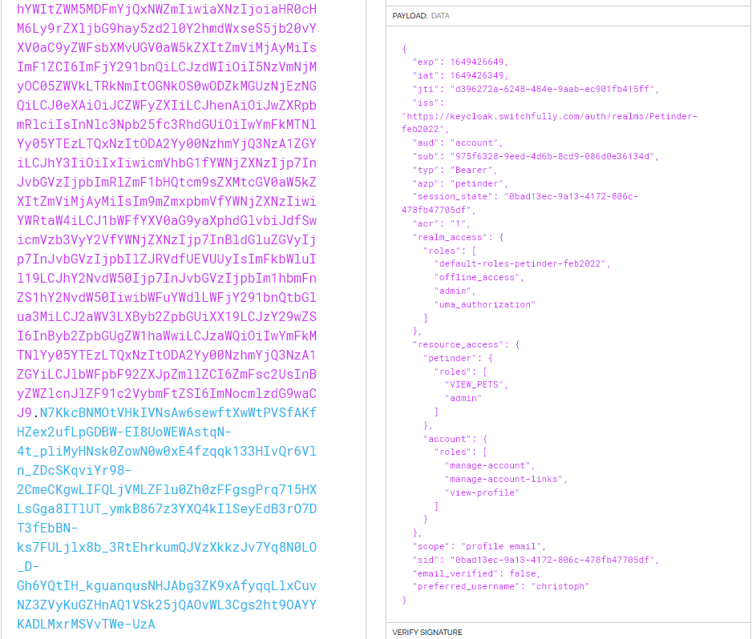

## Securing our app with Spring Security and Keycloak

We have provided an app for you! It's a million dolla.... Yeah okay it's Petinder again. You can find it at [https://github.com/switchfully/petinder-minimal](https://github.com/switchfully/petinder-minimal). Clone it and use it in this codelab!

In order to build a connection with Keycloak, we need to configure a few things in our app. We will have to:

- Add the right dependencies to our ``pom.xml``
- Provide the necessary connection details for Keycloak in ``application.properties``
- Add a ``WebConfig`` class to configure our security rules
- Provide a mapping method that extract the roles a user has out of our ``jwt``, so our app can check if a user is authorized to perform certain actions
- Add security annotations in our controller, specifying what authorizations are needed for which endpoint

It sounds like a LOT of work, but you'll see it's not that complicated. Let's dive in!

### Adding the right dependencies

First things first, let's fix our dependencies. We used to have to add several dependencies to enable both Spring Security and Keycloak, but this changed recently. Now we only need two dependencies to use Keycloak as our authorization server.

* Add the following dependencies to your ``pom.xml`` file:
``` 
<dependency>
  <groupId>org.springframework.boot</groupId>
  <artifactId>spring-boot-starter-oauth2-client</artifactId>
  <version>2.6.5</version>
</dependency>
<dependency>
  <groupId>org.springframework.boot</groupId>
  <artifactId>spring-boot-starter-oauth2-resource-server</artifactId>
  <version>2.6.5</version>
 </dependency>
```

By adding these two dependencies, we add multiple functionalities to our app:
- Spring Security is included in these dependencies, so no need to add it as a separate one
- support for OAuth2 and OIDC clients
- The ability to make Spring Boot auto-discover the available endpoints in our resource server

In the past, we had to configure lots of things to make Keycloak work, by adding the oauth2-resource-server dependency these things will be auto-discovered and we don't have to configure them explicitly anymore. Makes our job a lot easier!
Don't forget to refresh your Maven imports and let's move on to the next step.

### Configuring Keycloak in application.properties

* In order to have our app communicate with Keycloak, we need to configure some things. Move to ``application.properties`` and add following lines:
  - spring.security.oauth2.resourceserver.jwt.issuer-uri=https://keycloak.switchfully.com/auth/realms/java-apr-2022
  - keycloak.auth-server-url=https://keycloak.switchfully.com
  - keycloak.realm=petinder-feb2022
  - keycloak.resource=<yourClientName>
  - keycloak.credentials.secret=<theSecretYouCopiedEarlier>

By adding these configuration options to our ``application.properties`` file, Spring Boot will be pointed to the correct Keycloak server, realm and client. The secret authorizes our app to talk to Keycloak. It's the equivalent of Keycloak asking our app "do I know you?" and our app
responding with "of course you do, here, I'll prove it to you!". The first line is a config for accessing Keycloak as a OAuth2 resource server. It will allow our app to discover lots of configuration by itself instead of having to provide it manually.

### Protecting our code

Let's determine what parts of our code we want to secure. We'll start with adding a file which we'll call ``WebSecurityConfig``. You can call it whatever you want, but ``WebSecurityConfig`` or ``SecurityConfig`` are the most common names for it.
- Create a class called ``WebSecurityConfig``. Put it in a security module in your codebase, that way we can separate security related classes easily from the rest of our code.
- The ``WebSecurityConfig`` class extends from the ``WebSecurityConfigurerAdapter``. Annotate it with ``@Configuration`` so that it becomes managed by Spring's Application Context.
- Use IntelliJ's auto-generate tool to override the ``configure(HttpSecurity http)`` method.
- Inside this method, we will add the logic to configure our security rules. Type ``http.``, a bunch of options will pop up.
- The first one you'll add is ``cors()``, it will enable cors configurations for your project. We'll learn more about cors (Cross Origin Requests) during the web development module.
- next up is ``.and()``, no real explanation needed here, we use it to jump from part to part in this http configuration. cors() was one part, now comes the next.
- add ``.authorizeRequests().anyRequest().authenticated()``. It will configure our app to expect any request to be authorized and authenticated.
- Add another ``.and()`` and continue with ``oauth2ResourceServer().jwt().jwtAuthenticationConverter(jwtAuthenticationConverter());`` This enables the oauth2ResourceServer configuration and tells our app it expects to receive a ``jwt`` from it to authorize users. The ``jwtAuthenticationConverter`` will convert our jwt to
  something Java can interpret, so that we can extract our roles from it and see whether a user is actually authorized to use a certain endpoint. This method doesn't exist yet, we'll build it now.

### The jwtAuthenticationConverter method

Securing our app by expecting a ``jwt`` is not enough. We are looking to authorize our endpoints based on certain roles a user has. These roles are encoded in our ``jwt``, so we need a way to extract them from the token. We'll write a separate class to map our roles.

- Make a new class called ``KeycloakGrantedAuthoritiesConverter``. Make sure it implements the ``Converter<Jwt, Collection<GrantedAuthority>`` interface. Both ``GrantedAuthority`` and ``Jwt`` are parts of ``org.springframework.security`` so you should be able to import them without having to add extra dependencies.
- Use IntelliJ's auto-generate tool to override the ``convert`` method.
- In this method, we will write the logic to extract our roles from our token. Let's start by taking a look at what the contents of our token look like.



You can see the contents of the decoded token. In the previous codelab, we created a client and roles for that client. Afterwards, we created a user and mapped the ``VIEW_PETS`` role to that user. Take a closer look and try to see where the roles are that we want to work with.

- You can see two places where roles are present. Under ``realm_access`` and under ``resource_access``. Realm are, obviously, realm-wide roles. Resource are the roles specific to the clients. Under ``resource_access``, you can see the petinder client and under that client, you can see the roles our user has for it. We will have to make our method return those roles.
- Make a ``Map<String, Object>``, name it ``resourceAccess`` and initialize it with the result of the ``getClaimsAsMap()`` method. This method is present on our Jwt instance which we provided in the method signature. Pass the string of the field you want to map on to that ``getClaimsAsMap`` method. In this case, it will be ``resource_access`` since that's where our client is under. Doing this will create a map with all the content in the ``resource_access`` field in our ``jwt``.
- Now do the same thing for a ``clientAccess`` Map and use the ``get()`` method on the previous Map to get the contents under your client (in our case, it was called "petinder", yours will be different). You will have to cast this to a ``Map<String, Object>``, IntelliJ will guide you to it.
- ``clientAccess`` now contains the information related to our client in our token. Let's put the info we need in a List. Create a List of Strings called roles and get the roles from the ``clientAccess`` map.
- Now that we have our List of roles, stream over them and map each role to a new SimpleGrantedAuthority object. End the stream by collecting them into a List.

We now created a method that will get the client-specific roles a user has from within our ``jwt``. It will map these roles to SimpleGrantedAuthority objects, which we can use to see if a user is authorized to perform a certain action. In order to use this, we have to go back to our ``WebSecurityConfig`` and finish the ``jwtAuthenticationConverter`` method.

- Create a method called ``jwtAuthenticationConverter()``, its return type is JwtAuthenticationConverter.
- Inside the method, initialize a JwtAuthenticationConverter instance called ``converter``.
- On converter, call the ``setJwtGrantedAuthoritiesConverter`` method and pass a ``new KeycloakGrantedAuthoritiesConverter()`` on as a parameter.
- Don't forget to return the converter.

All done! We now have added functionality that instructs our app to be secured by using tokens. On top of that, we can extract specific roles for our client from that token and use these to see if a user is authorized to perform certain tasks.

### Securing endpoints

All that's left is securing our endpoints. That's the easy part!

- Add ``@EnableGlobalMethodSecurity(prePostEnabled = true)`` as an annotation to the ``WebSecurityConfig`` class. It instructs it to take method annotations concerning authorization into account.
- Go to the ``PetController``, find the ``getAllPets()`` method and add the following annotation:
  - @PreAuthorize("hasAuthority('VIEW_PETS')")

Once you did this, your ``getAllPets()`` endpoint is secured. It will now check whether the user has the ``VIEW_PETS`` role or not. If not, he will not be authorized to use this method and the call will fail.

That's it for our code! The app is now secured through Keycloak and expects a ``jwt`` of its users. It will be able to extract client-specific roles from that token and secure its methods based on those roles.

In this codelab, you learned:

- The dependencies needed to use Keycloak with Spring Security
- How to configure security rules for your app in the ``WebSecurityConfig`` file.
- How to extract roles from a ``jwt`` and map them, enabling your app to use them as authorization for endpoints.
- How to secure endpoints by using ``@PreAuthorize``

This implementation is all fine and dandy, but how do we test this? Codelab03 will show you how to do this with Postman!

