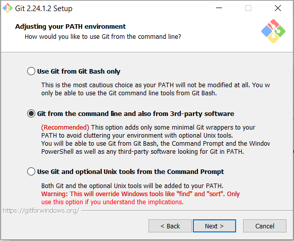
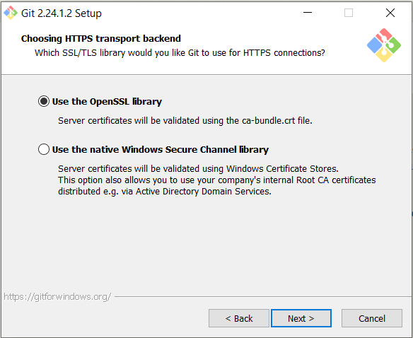
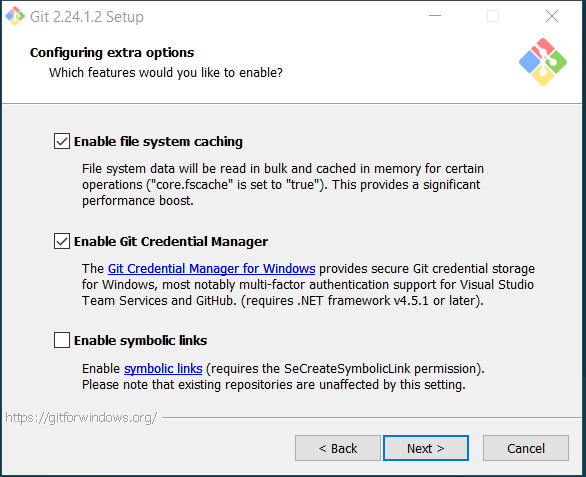
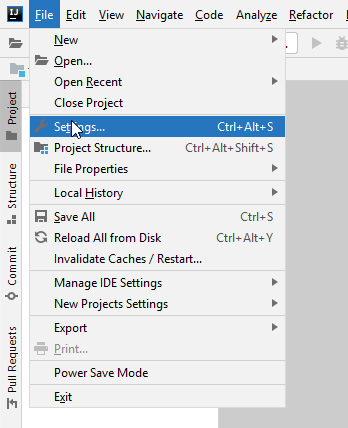
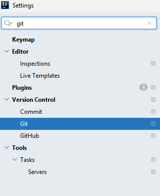
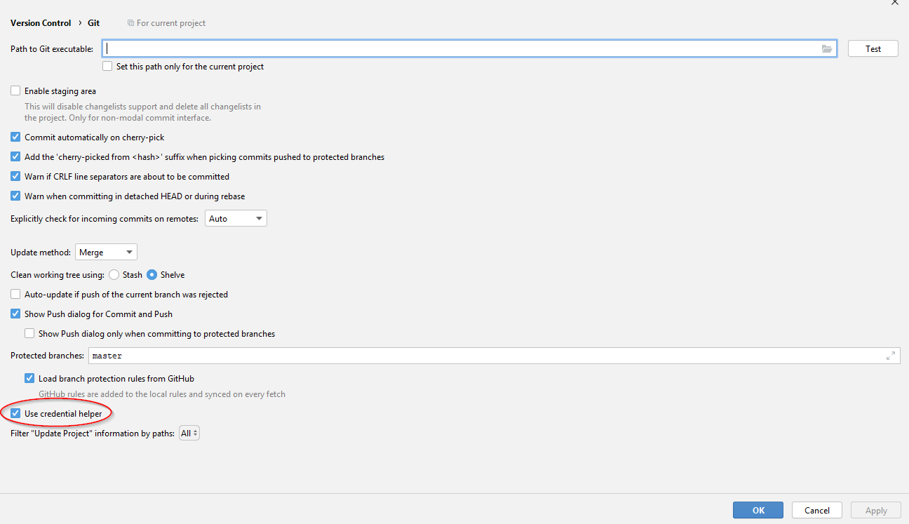

# Switchfully Setup & Software installation guide

## Installations & Access

Following applications need to be installed

#### FOD-fin applications (skip if not applicable)
- [ ] VPN
- [ ] OneDrive
- [ ] Office365
- [ ] Microsoft Authenticator (mobile application)

#### Switchfully applications/setup
- [ ] [General setup](#general-setup)
- [ ] [Browser (Chrome)](#browser)
- [ ] [Zoom](#zoom)
- [ ] [Slack](#slack)
- [ ] [Editor (Visual Code)](#editor)
- [x] [Github](#github-account)
- [ ] [Git](#git)
- [ ] [Java](#java)
- [ ] [Intellij Ultimate](#intellij-ultimate)
- [ ] [Getting started with java track](#get-started-with-the-switchfully-java-track)
- ---
- [ ] [SoapUI (can be done later)](#soapui)
- [ ] [Postman (can be done later)](#postman)
- [ ] Node/NPM (can be done later)

## General setup
Let us create a **consistent** setup for the entire team:

Create 2 folders

`C:\_development`\
`C:\_development\.programs`

> **_NOTE:_**  Why `_development` & `.programs`? \
As a developper we want structure, control & avoid problems where possible.\
The `_` folder will appear at the top (which is very convenient 🤠).

## Browser
Download and install a browser
>The first step is for Chrome
1. Download the installer from: https://www.google.com/intl/en/chrome/
2. Follow the steps in the wizard
3. Bookmark following URLs:
    * https://github.com/switchfully/shared-2023-feb
    * https://github.com/switchfully/java-2023-feb
    * https://switchfully.slack.com/

## Zoom
It's not (all) about code! It's about communication!

#### Create a Zoom account
1. Go to https://zoom.us/signup
2. Follow the steps in the wizard

#### Install zoom client
1. Go to https://zoom.us/download
2. Download the "Zoom Client for Meetings" installer
3. Follow the steps in the wizard

## Slack
Download and install the slack client
1. Go to https://slack.com/intl/en-be/downloads/windows
2. Download 64-BIT installer
3. Follow the steps in the wizard
    1. Link for the workspace: https://switchfully.slack.com/

## Editor
Download and install an editor (Notepad++, Sublime, Visual Studio Code, ...)\
> First step is for Visual Studio Code
1. Go to https://code.visualstudio.com/
2. Download the installer
3. Follow the steps in the wizard

## Github account
Normally you should already have one! \
Don't forget to turn it into an Educational account.

## Git
#### Install Git
1. Download the installer at https://git-scm.com/download/win
2. Follow the steps in the wizard
> **_NOTE:_**  Please pay attention to the exact options you select while installing Git (and other software), so you have the same setup as the rest of the team.

  
Click to show screenshot details!

>**_TERMINAL TEST_**\
`git --version`

#### Configuration
1. Go to https://git-scm.com/book/en/v2/Getting-Started-First-Time-Git-Setup
2. Read this page (mainly the "Your Identity" part)
    - Configure *github* username
    - Configure *github* email
>**_TERMINAL TEST_**\
`git config --list`

## Java
> Multiple versions of Java exist, from different companies.\
We use JDK 17.

1. Browse to the Oracle website (https://www.oracle.com/java/technologies/downloads/#jdk17-windows)
2. Download the JDK 17 zip file (the binaries, not the sources)
   - https://download.oracle.com/java/17/latest/jdk-17_windows-x64_bin.zip
3. Unzip it into `C:\_development\.programs`

> **_NOTE:_**  Unzip?? No install? \
Indeed! You do not have to 'install' the JDK java with a `*.exe`, just unzip it and **set the necessary environment variables** (`JAVA_HOME` & `PATH`).\
Oracle, a company that sells a commercial version of java, provides both an installer and a zip file with binaries.

### Set the necessary environment variables
1. Setup `JAVA_HOME`
    1. Go to `System Properties` or type `<windows-key>` + "environment variables"
    1. In the tab `Advanced` click `Environment Variables...`
    1. This screen is split in 2 parts (User variables & System variables)
    1. Create a new System Variable in called "JAVA_HOME", `C:\_development\.programs\<java_folder>`

1. Setup your `Path` variable
    1. In the same screen.
    1. Edit `Path`
    1. Add `%JAVA_HOME%\bin`

>**TERMINAL TEST**:\
`java --version`\
`javac --version`

## IntelliJ ultimate
Download and install Intellij
1. Install IntelliJ ultimate
2. Activate IntelliJ
    1. Get an IntelliJ license through GitHub Education
    2. Start IntelliJ
    3. Activate the **free trial**
    4. Go to Help > Register
        - Fill in your username/e-mail and password of your intelliJ account
        - Activate the license (this should work)

---

Setup the Credentials Helper
1. Open Intellij
1. Go to settings
    1. 
1. Go to the Git submenu
    1. 
1. Select the credential helper checkbox
    1. 

---

IntelliJ Cheat sheet https://resources.jetbrains.com/storage/products/intellij-idea/docs/IntelliJIDEA_ReferenceCard.pdf

## Maven
1. Go to https://maven.apache.org/
2. Download the maven binary zipfile -> https://dlcdn.apache.org/maven/maven-3/3.8.6/binaries/apache-maven-3.8.6-bin.zip
3. Unzip it: `C:\_development\.programs`

Add the maven bin folder to the `Path` (in the same way as you did for the JDK)

>**TERMINAL TEST**:\
`mvn -v`

## Get started with the Switchfully java track
> **_NOTE:_**\
> Git Cheat Sheet https://github.github.com/training-kit/downloads/github-git-cheat-sheet.pdf
1. Fork the java track: https://github.com/switchfully/java-feb-2023
2. Clone your fork into C:\_development\switchfully
3. Open your project with IntellIj: File -> Open -> Select the "track-java"-folder
4. Configure your sdk
    1. Go to file > project structure (or press `ctrl+alt+shift+s`)
    2. Select the project menu on the left hand side
    3. Under "project sdk" press the new button
    4. Select the jdk folder in **C:\_development\.programs\java**
    5. After that select your new jdk as the default jdk
    6. Set project language level to 17
5. Go to intellij
    1. On the right-hand-side you have a M (maven) button. Click it.
    2. Click on reimport projects (its the button with the two arrows in a circle)
    3. You shouldn't get any error anymore
---
## SoapUI

Download and install SoapUI
1. Go to https://www.soapui.org/downloads/soapui/
2. Download the Open Source version
3. Follow the steps in the wizard

## Postman
#### Create a Postman account
1. Go to https://identity.getpostman.com/signup
2. Create a free account
#### Download and install Postman
1. Go to https://www.postman.com/downloads/
1. Download the 64-bit installer
1. Follow the steps in the wizard

## Go Forth and Code
🚀 👩‍💻 👨‍💻 🎯 
